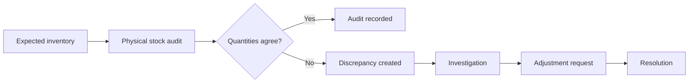

# StockFlow

> **Track stock. Detect discrepancies. Manage smarter.**

[](https://stockflow-bixuacci.manus.space)
[](https://stockflow-bixuacci.manus.space)
[](#local-development)

StockFlow is an operational inventory workspace that puts **stock evidence before stock assumptions**. It helps a warehouse or retail team surface the difference between expected and physical quantities, record the audit evidence, and move the discrepancy into a clear review workflow.

| Open the project | Purpose |
| --- | --- |
| [Launch the live StockFlow workspace](https://stockflow-bixuacci.manus.space) | Explore the responsive interactive demonstration. |
| [Jump to the core workflow](#core-workflow) | Follow the audit-to-discrepancy journey. |
| [Read the implementation scope](#implementation-scope) | Understand what is client-side today and what a production backend would add. |
| [Start locally](#local-development) | Run the project with pnpm. |

---

## Why StockFlow

Inventory systems become unreliable when changes happen without provenance. StockFlow treats the stock record like an operational ledger: every audit, sale, transfer, or exception has context, a visible status, and a clear next action. The interface uses a **Ledger & Signal** visual language, where warm paper-like surfaces hold routine data and focused teal, amber, and brick signals bring exceptions forward.

### Core workflow



The demonstration starts with the key StockFlow scenario: **Rice, 5kg** has an expected count and a physical count that differ. Users can create another audit count, see a discrepancy open automatically, investigate an exception stage, and then request an adjustment.

<details>
<summary><strong>Explore the workflow in the live workspace</strong></summary>

| Step | Where to go | What to try |
| --- | --- | --- |
| 1 | **Overview** | Review the stock-value, low-stock, sales, and discrepancy signals. |
| 2 | **Stock audits** | Submit a physical count that differs from the expected quantity. |
| 3 | **Discrepancies** | Select the new exception, take ownership, or request an adjustment. |
| 4 | **Point of sale** | Add a product, adjust quantities, and complete a sale against available stock. |
| 5 | **Reports** | Export the inventory register as CSV. |

</details>

---

## Workspace modules

StockFlow is organised into two deliberately different areas: **intelligence**, where teams read the current state of inventory, and **workflows**, where teams act on it. The persistent navigation rail makes the distinction clear on desktop and becomes a focused sheet on compact screens.

| Area | Module | Interactive capability |
| --- | --- | --- |
| Intelligence | Overview | Sales trend, inventory value mix, current signals, and recent movement evidence. |
| Intelligence | Inventory register | Search, stock-status filtering, validation-aware product creation, and warehouse quantities. |
| Intelligence | Discrepancy desk | Exception selection, investigation context, stage updates, and adjustment requests. |
| Intelligence | Stock audits | Physical-count submission that creates an audit record and opens a discrepancy when values differ. |
| Workflows | Transfers | A warehouse-to-warehouse transfer request with source, destination, quantity, and custody sequence. |
| Workflows | Point of sale | Stock-aware cart, quantity controls, tax calculation, checkout feedback, and client-side quantity updates. |
| Workflows | Reports | Decision cues, core reporting set, and CSV export for the current inventory register. |
| Workflows | Activity ledger | A readable trail of stock-affecting transactions and their quantities. |

<details>
<summary><strong>Interaction principles</strong></summary>

StockFlow makes operational actions feel deliberate. A selected discrepancy exposes its evidence in place rather than taking users into a dead-end page. A completed POS sale reduces the displayed available quantity. Audit counts validate negative values and generate an exception when the physical quantity differs from the register. Notifications can be opened and marked as read. These interactions are backed by browser-local state in the current implementation.

</details>

---

## Design system

The interface is intentionally not a generic dashboard. It follows a contemporary editorial systems aesthetic that pairs data density with traceability.

| Design decision | Expression in StockFlow |
| --- | --- |
| **Ink Navy** | Anchors the navigation spine and establishes a controlled operations-console environment. |
| **Flow Teal `#00A889`** | Indicates healthy flow, active navigation, primary actions, and the three-step brand glyph. |
| **Amber and Brick** | Reserved for warning, expiry, and discrepancy conditions so exceptions lead the eye. |
| **Ledger rules** | Fine horizontal rules, monospace identifiers, timestamps, and record labels make transactions feel auditable. |
| **Manrope + DM Mono** | Combines clear operational headings and numerals with a technical metadata rhythm. |

The three-step flow glyph appears in the primary shell as a compact symbol for the product’s receiving → verification → movement model.

---

## Local development

### Prerequisites

Use a modern Node.js environment with pnpm available. The project is a Vite-powered **vanilla JavaScript** client application and does not require a database or server-side environment for the interactive demonstration.

### Run the workspace

```bash
git clone https://github.com/Iyyappan-S/stockflow-inventory.git
cd stockflow-inventory
pnpm install
pnpm dev
```

Open the local URL printed by Vite. The dashboard loads at the root route.

### Quality checks

```bash
pnpm check
pnpm build
```

| Command | Result |
| --- | --- |
| `pnpm dev` | Starts the Vite development server. |
| `pnpm check` | Runs the TypeScript type checker without emitting output. |
| `pnpm build` | Produces the production bundle. |
| `pnpm preview` | Serves the production bundle for local review. |

---

## Project structure

```text
stockflow-inventory/
├── client/
│   ├── index.html                  # Semantic application entry point
│   ├── css/
│   │   └── main.css                # Ledger & Signal visual system
│   └── js/
│       ├── app.js                  # State, validation, workflows, and events
│       ├── data.js                 # Demonstration records and dashboard data
│       └── render.js               # Semantic HTML view rendering
├── ideas.md                         # Design rationale and brand decisions
├── todo.md                          # Delivery checklist
└── package.json
```

---

## Implementation scope

This repository currently delivers a **responsive client-side interactive demonstration**. It models inventory actions with browser-local vanilla JavaScript state so the full workspace can be explored without credentials or a database.

| Included now | Production backend extension |
| --- | --- |
| Responsive dashboard, inventory register, audit workflow, discrepancy states, POS flow, notifications, transfer interface, and CSV export. | Spring Boot REST API, MySQL persistence, JWT authentication, role-based authorization, server-side validation, durable audit logs, and transactional stock updates. |
| Client-side field validation and stock-aware checkout guardrails. | Concurrency controls, immutable inventory transactions, approval policies, reporting queries, and scheduled expiry alerts. |
| Demonstration data held in browser memory for the active session. | Seeded database records, supplier/purchase management, real invoice generation, and multi-user workflows. |

> **Important:** This README does not claim that the client-side demonstration includes a working Java/MySQL backend. The original system specification can be extended in that direction without changing the existing interface vocabulary or user journeys.

<details>
<summary><strong>Suggested backend integration sequence</strong></summary>

Start by moving products, warehouses, transactions, audits, and discrepancies into a normalized MySQL schema. Expose the inventory and audit workflows through a Spring Boot REST API with server-side transaction boundaries. Add JWT-based roles for administrators, warehouse managers, inventory managers, and cashiers. Finally, replace the local state functions in `client/js/app.js` with authenticated requests while retaining the current interface states and validation feedback.

</details>

---

## Deployment

The current interactive workspace is available at [stockflow-bixuacci.manus.space](https://stockflow-bixuacci.manus.space). For a separate hosting environment, build the client with `pnpm build` and serve the generated static output from a provider that supports a single-page application fallback.

When a Spring Boot backend is introduced, configure the client API base URL through environment variables, restrict CORS to approved origins, and keep JWT secrets and database credentials outside the repository.

---

## Contribution guide

Please keep the operational model coherent when extending the project. New inventory-changing actions should surface a visible ledger record, error states should explain the operational consequence, and semantic colors should remain reserved for meaningful signals.

```text
feat: add stock-transfer receiving state
fix: prevent POS quantity from exceeding available stock
docs: clarify audit reconciliation workflow
```

## License

This project is provided for educational and portfolio demonstration purposes. Confirm licensing requirements for any production deployment or third-party integration.
